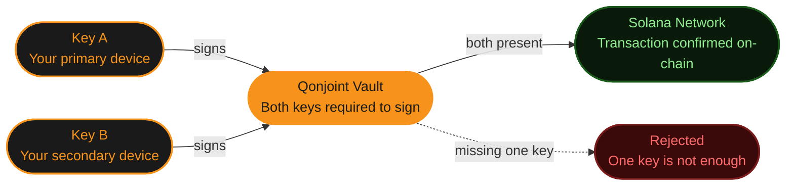

# The World's First Quantum-Proof Shield for Your Coins

*Qonjoint: The dual-key protocol that makes your vault untouchable*

---

## What is bitQoin

bitQoin is the world's first quantum-proof shield for your coins. Built on Solana, it implements the **Qonjoint protocol**: a dual-key architecture where a single compromised key can never move your funds. Both keys must sign. No exceptions.

---

## Repositories

<table>
  <tr>
    <td>
      <a href="https://github.com/bitqoinorg/wallet"><strong>wallet</strong></a> 
      React · Vite · Tailwind · TypeScript 
      public
    </td>
    <td>
      <a href="https://github.com/bitqoinorg/api"><strong>api</strong></a> 
      Express · Helius RPC · Node.js 
      private
    </td>
    <td>
      <a href="https://github.com/bitqoinorg/protocol"><strong>protocol</strong></a> 
      Qonjoint specification 
      public
    </td>
  </tr>
</table>

---

## Qonjoint Architecture

How a Qonjoint vault works: two independent keys are required to authorize every transaction. Neither key alone can move funds. Both must sign. The Solana runtime enforces this at the validator level.

> Both keys live on separate devices. Losing one does not compromise the other.

---

## Stack

| Layer | Technology |
|---|---|
| Frontend | React 18, Vite, Tailwind CSS, TypeScript |
| Backend | Express 5, Node.js, Pino |
| Blockchain | Solana, @solana/web3.js, Helius RPC |
| Vault | Qonjoint protocol |
| i18n | EN, JA, ZH, DE, ES, AR |
| Explorer | Orb Markets |
| Deploy | GitHub Pages |

---

## Team

<table align="center">
  <tr>
    <td align="center" width="180">
      <a href="https://github.com/kaiming-lang">
         
        <strong>Kai</strong> 
        <code>@kaiming-lang</code> 
        quant, founder
      </a>
    </td>
    <td align="center" width="180">
      <a href="https://github.com/apps/bitqoiner">
         
        <strong>bitqoiner</strong> 
        <code>@bitqoiner[bot]</code> 
        automated commit assistant
      </a>
    </td>
  </tr>
</table>

---

**Built without compromise.**

[bitqoin.org](https://bitqoin.org) · [x.com/bitqoinorg](https://x.com/bitqoinorg) · [github.com/bitqoinorg](https://github.com/bitqoinorg)

